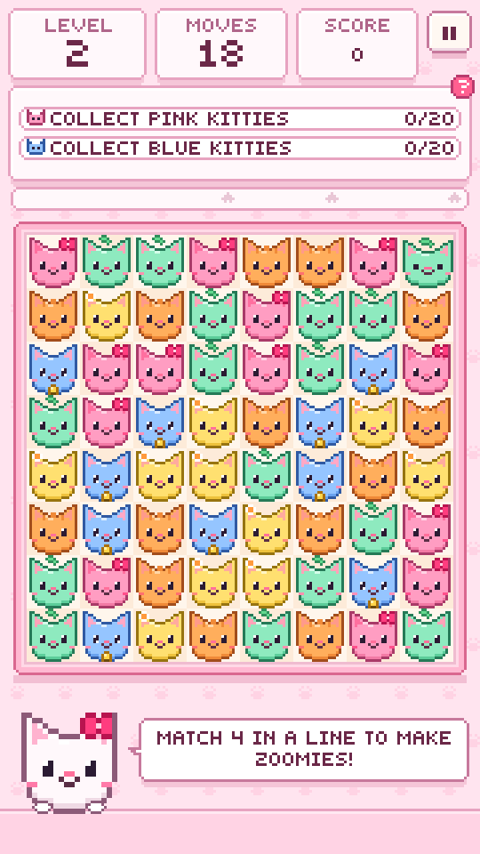
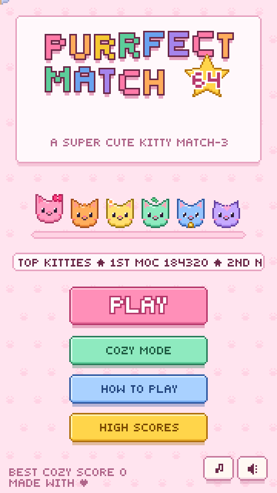
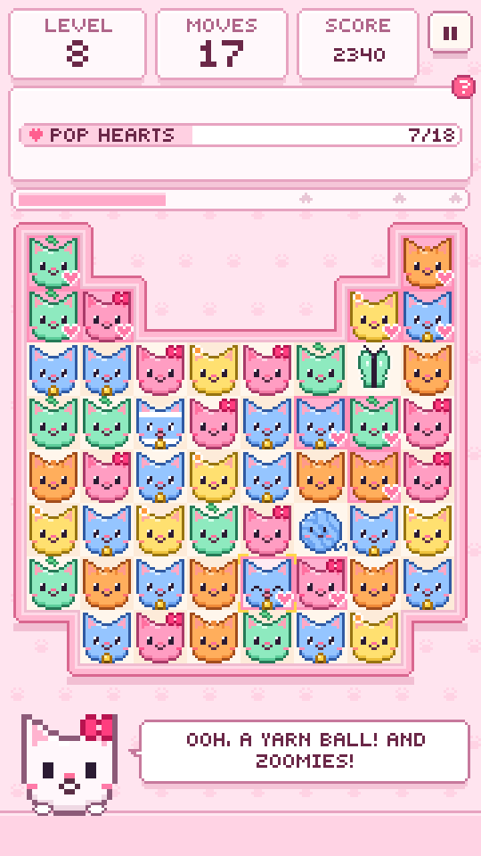
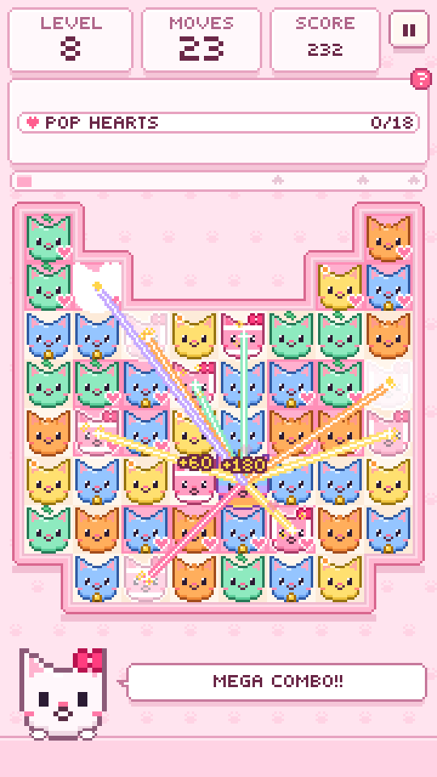
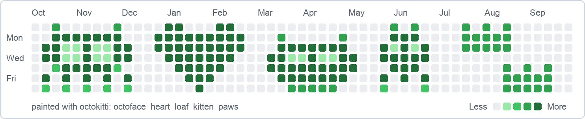

<h1 align="center">🐙🐱 octokat</h1>

<p align="center"><b>Meow.</b> A tiny corner of GitHub where everything is a kitty.</p>

<p align="center">
  <a href="https://melscoop.github.io/octokat/purrfect-match/"></a>
</p>

<p align="center">
  <a href="https://melscoop.github.io/octokat/purrfect-match/"><b>▶ Play Purrfect Match 64</b></a>
  &nbsp;·&nbsp;
  <a href="OCTOKITTI.md"><b>🐙 Paint octocats on your contribution graph</b></a>
</p>

Two small, very cute things live here:

- 🐱✨ **Purrfect Match 64**: a pixel-art kitty match-3 you can play in your browser right now.
- 🐙 **octokitti**: paints pixel octocats onto your GitHub contribution graph.

## 🐱✨ Purrfect Match 64

> Swap the kitties. Line up three. Make zoomies. Climb the Top Kitties board. 💕

A super cute match-3, drawn pixel by pixel on a tiny 180×320 screen, with
chiptune music and synthesised meows. The whole game is one self-contained HTML
file: no installs, no downloads, and it plays happily on phones.

**[▶ Play it now](https://melscoop.github.io/octokat/purrfect-match/)**, or open
[`purrfect-match/index.html`](purrfect-match/index.html) in any browser.

<table>
  <tr>
    <td align="center"><br><sub><b>Hello, kitties!</b></sub></td>
    <td align="center"><br><sub><b>A kitty-face board</b></sub></td>
    <td align="center"><br><sub><b>Rainbow kitty + zoomies</b></sub></td>
  </tr>
  <tr>
    <td align="center"><br><sub><b>Every goal, explained</b></sub></td>
    <td align="center"><br><sub><b>Top Kitties (example scores)</b></sub></td>
    <td align="center"><br><sub><b>Level clear!</b></sub></td>
  </tr>
</table>

### Meet the kitties


Every kitty has its own look as well as its own colour, so they're easy to tell
apart even when colours are tricky to see.

### Special kitties


| Match | You get | What it does |
| --- | --- | --- |
| 4 in a line | **Zoomies** | dashes across a whole row or column |
| an L or T shape | **Yarn ball** | unravels in a fluffy 3×3 burst |
| a 2×2 square | **Butterfly** | flutters off to boop a tricky spot, like a sleepy box |
| 5 in a line | **Rainbow kitty** | swap it with any kitty to clear every kitty of that colour |

Swap two specials into each other for a **mega combo**. Rainbow + zoomies turns a
whole colour into zoomies, and two rainbow kitties clear the entire board. 🌈

### What's inside

- 🐾 **20 levels**: heart tiles to pop, sleepy kitties to wake from their boxes,
  and kitty-face and heart-shaped boards
- ⭐ Up to three stars per level, and a **Kitty Party** bonus round that turns
  leftover moves into zoomies
- 🏆 A global **Top Kitties** leaderboard with arcade initials. Every score is
  checked by replaying your game on the server, so no cheaty kitties
- ☁️ **Cozy mode**: no goals, no move limit, just kitties
- 🎵 Chiptune music, meows, a mascot full of cat puns, and mouse, touch and
  keyboard controls

📖 **[Read the full Purrfect Match guide](PURRFECT-MATCH.md)**: controls, combos,
goals, the leaderboard, and how it's built.

## 🐙 octokitti

**gitfiti, but the only palette is octocats.** Your contribution graph is a
7 × 53 pixel canvas with five shades. octokitti fills it with octocats by making
backdated empty commits. Fourteen kats, no dependencies: just Python 3.8+ and
`git`.

<picture>
  <source media="(prefers-color-scheme: dark)" srcset="screenshots/octokitti-dark.png">
  
</picture>

```sh
python3 octokitti.py list                                  # meet all fourteen kats
python3 octokitti.py preview octoface heart loaf --gap 2   # see it before you paint
python3 octokitti.py animate                               # a kat parade in your terminal
python3 octokitti.py paint octoface --repo ../kat-canvas   # dry run; add --yes to paint
```

It's careful, too. Everything is a dry run until you say `--yes`, it won't
clobber real commits, and `undo` puts things back the way they were.

📖 **[Read the octokitti guide](OCTOKITTI.md)**: drawing your own kats, shading
tips, and painting safely.

## 🧪 Tests

```sh
node --test tests/                       # Purrfect Match engine and leaderboard
python3 -m unittest discover -s tests    # octokitti
```

<details>
<summary>🐙 <b>Meow.</b> Peek at the original octokat</summary>

<pre>
                             ,'`                                                                                                                                         .+
                             @@@@@@.                                                                                                                                 ;@@@@@;
                             @@@@@@@@@;                                                                                                                          `#@@@@@@@@@
                            +@@@@@@@@@@@@;                                                                                                                     #@@@@@@@@@@@@
                            @@@@@@@@@@@@@@@@,                                                                                                               '@@@@@@@@@@@@@@@+
                            @@@@@@@@@@@@@@@@@@#                                                                                                          `@@@@@@@@@@@@@@@@@@@
                           +@@@@@@@@@@@@@@@@@@@@@`                                                                                                     ;@@@@@@@@@@@@@@@@@@@@@
                           @@@@@@@@@@@@@@@@@@@@@@@@:                                                                                                 #@@@@@@@@@@@@@@@@@@@@@@@'
                           @@@@@@@@@@@@@@@@@@@@@@@@@@;                                                                                             @@@@@@@@@@@@@@@@@@@@@@@@@@@
                          :@@@@@@@@@@@@@@@@@@@@@@@@@@@@'                                                                                         @@@@@@@@@@@@@@@@@@@@@@@@@@@@@
                          @@@@@@@@'  '@@@@@@@@@@@@@@@@@@@;                                                                                     @@@@@@@@@@@@@@@@@@@@,  @@@@@@@@,
                          @@@@@@@@      +@@@@@@@@@@@@@@@@@@:                                                                                 #@@@@@@@@@@@@@@@@@@:     +@@@@@@@@
                          @@@@@@@@        `@@@@@@@@@@@@@@@@@@`                                                                             '@@@@@@@@@@@@@@@@@#         @@@@@@@@
                         '@@@@@@@@           +@@@@@@@@@@@@@@@@@                                                                          ,@@@@@@@@@@@@@@@@@:           @@@@@@@@
                         @@@@@@@@,             ;@@@@@@@@@@@@@@@@#                                                                       @@@@@@@@@@@@@@@@@`             @@@@@@@@,
                         @@@@@@@@                ,@@@@@@@@@@@@@@@@,                                                                   #@@@@@@@@@@@@@@@@                '@@@@@@@#
                         @@@@@@@@                  .@@@@@@@@@@@@@@@@                                                                ,@@@@@@@@@@@@@@@@                   @@@@@@@@
                        ,@@@@@@@@                    .@@@@@@@@@@@@@@@+                                                             @@@@@@@@@@@@@@@@                     @@@@@@@@
                        #@@@@@@@;                      ,@@@@@@@@@@@@@@@`                                                         '@@@@@@@@@@@@@@@                       @@@@@@@@
                        @@@@@@@@                         '@@@@@@@@@@@@@@#          .:+@@@@@@@@@@@@@@@@@@@@@@@@@@@@@',`          @@@@@@@@@@@@@@@`                        @@@@@@@@,
                        @@@@@@@@                           @@@@@@@@@@@@@@@`  ,#@@@@@@@@@@@@@@@@@@@@@@@@@@@@@@@@@@@@@@@@@@@'`  '@@@@@@@@@@@@@@;                          :@@@@@@@+
                        @@@@@@@@                             @@@@@@@@@@@@@@@@@@@@@@@@@@@@@@@@@@@@@@@@@@@@@@@@@@@@@@@@@@@@@@@@@@@@@@@@@@@@@@#                            `@@@@@@@@
                        @@@@@@@@                              :@@@@@@@@@@@@@@@@@@@@@@@@@@@@@@@@@@@@@@@@@@@@@@@@@@@@@@@@@@@@@@@@@@@@@@@@@@@                               @@@@@@@@
                       ,@@@@@@@#                                @@@@@@@@@@@@@@@@@@@@@@@@@@@@@@@@@@@@@@@@@@@@@@@@@@@@@@@@@@@@@@@@@@@@@@@@:                                @@@@@@@@
                       +@@@@@@@:                                 `@@@@@@@@@@@@@@@@@@@@@@@@@@@@@@@@@@@@@@@@@@@@@@@@@@@@@@@@@@@@@@@@@@@@@                                  @@@@@@@@
                       @@@@@@@@                                    #@@@@@@@@@@@@@@@@@@@@@@@@@@@@@@@@@@@@@@@@@@@@@@@@@@@@@@@@@@@@@@@@@.                                   @@@@@@@@
                       @@@@@@@@                                      @@@@@@@@@@@@@@@@@@@@@@@@@@@@@@@@@@@@@@@@@@@@@@@@@@@@@@@@@@@@@@@                                     +@@@@@@@,
                       @@@@@@@@                                       #@@@@@@@@@@@@@',                            `:+@@@@@@@@@@@@@.                                      :@@@@@@@'
                       @@@@@@@@                                        `@@@@@@;                                          .+@@@@@@                                        .@@@@@@@#
                       @@@@@@@@                                          #'                                                  .#:                                          @@@@@@@@
                       @@@@@@@@                                                                                                                                           @@@@@@@@
                       @@@@@@@@                                                                                                                                           @@@@@@@@
                       @@@@@@@@                                                                                                                                           @@@@@@@@
                       @@@@@@@@                                                                                                                                           @@@@@@@@
                      `@@@@@@@#                                                                                                                                           @@@@@@@@
                      `@@@@@@@#                                                                                                                                           @@@@@@@@
                      `@@@@@@@#                                                                                                                                           @@@@@@@@
                      `@@@@@@@#                                                                                                                                           @@@@@@@@
                      `@@@@@@@@                                                                                                                                           @@@@@@@@
                       @@@@@@@@                                                                                                                                           @@@@@@@@
                       @@@@@@@@                                                                                                                                           @@@@@@@@
                       @@@@@@@@                                                                                                                                           @@@@@@@@
                       @@@@@@@@                                                                                                                                          `@@@@@@@@
                       @@@@@@@@                                                                                                                                          '@@@@@@@'
                       @@@@@@@@.                                                                                                                                         @@@@@@@@.
                      '@@@@@@@@+                                                                                                                                         @@@@@@@@@
                     ,@@@@@@@@@@                                                                                                                                         @@@@@@@@@@
                     @@@@@@@@@@,                                                                                                                                         @@@@@@@@@@@
                    @@@@@@@@@@'                                                                                                                                           @@@@@@@@@@@
                   @@@@@@@@@@+                                                                                                                                             @@@@@@@@@@:
                  '@@@@@@@@@#                                                                                                                                               @@@@@@@@@@
                  @@@@@@@@@@                                                                                                                                                 @@@@@@@@@@
                 @@@@@@@@@@                                                                                                                                                  `@@@@@@@@@+
                '@@@@@@@@@                                                                                                                                                    ;@@@@@@@@@
                @@@@@@@@@,                                                                                                                                                     @@@@@@@@@@
               @@@@@@@@@#                                                                                                                                                       @@@@@@@@@,
              `@@@@@@@@@                                                                                                                                                        `@@@@@@@@@
              @@@@@@@@@`                                                                                                                                                         @@@@@@@@@;
             `@@@@@@@@@                                                                                                                                                           @@@@@@@@@
             @@@@@@@@@                                                                                                                                                            ;@@@@@@@@:
             @@@@@@@@+                                                                                                                                                             @@@@@@@@@
            @@@@@@@@@                                                                                                                                                              ,@@@@@@@@
            @@@@@@@@+                                                                                                                                                               @@@@@@@@@
           ,@@@@@@@@                                                                                                                                                                ;@@@@@@@@
           @@@@@@@@@                                                                                                                                                                 @@@@@@@@,
           @@@@@@@@`                                                                                                                                                                 @@@@@@@@@
          .@@@@@@@@                                                                                                                                                                  `@@@@@@@@
          @@@@@@@@#                                                                                                                                                                   @@@@@@@@`
          @@@@@@@@`                                    .+@@@@@@@@@@@@@@@@@@@@@@@#':.`                               `,;+@@@@@@@@@@@@@@@@@@@@@@@@;`                                    @@@@@@@@+
          @@@@@@@@                                 '@@@@@@@@@@@@@@@@@@@@@@@@@@@@@@@@@@@@@@@@@@@@@@@@@@@@@@@@@@@@@@@@@@@@@@@@@@@@@@@@@@@@@@@@@@@@@@@@@,                                .@@@@@@@@
         .@@@@@@@@                              +@@@@@@@@@@@@@@@@@@@@@@@@@@@@@@@@@@@@@@@@@@@@@@@@@@@@@@@@@@@@@@@@@@@@@@@@@@@@@@@@@@@@@@@@@@@@@@@@@@@@@@@:                              @@@@@@@@
         +@@@@@@@'                           `@@@@@@@@@@@@@@@@@@@@@@@@@@@@@@@@@@@@@@@@@@@@@@@@@@@@@@@@@@@@@@@@@@@@@@@@@@@@@@@@@@@@@@@@@@@@@@@@@@@@@@@@@@@@#                            @@@@@@@@
         @@@@@@@@`                          @@@@@@@@@@@@@@@@@@@@@@@@@@@@@@@@@@@@@@@@@@@@@@@@@@@@@@@@@@@@@@@@@@@@@@@@@@@@@@@@@@@@@@@@@@@@@@@@@@@@@@@@@@@@@@@@#                          @@@@@@@@,
         @@@@@@@@                         @@@@@@@@@@@@@@@@@@@@@@@@@@@@@@@@@@@@@@@@@@@@@@@@@@@@@@@@@@@@@@@@@@@@@@@@@@@@@@@@@@@@@@@@@@@@@@@@@@@@@@@@@@@@@@@@@@@@:                        :@@@@@@@+
         @@@@@@@@                       `@@@@@@@@@@@@@@@@@@@@@@@@@@@@@@@@@@@@@@@@@@@@@@@@@@@@@@@@@@@@@@@@@@@@@@@@@@@@@@@@@@@@@@@@@@@@@@@@@@@@@@@@@@@@@@@@@@@@@@@                       `@@@@@@@@
         @@@@@@@@                      '@@@@@@@@@@@@@@@@@@@@@@@@@@@@@@@@@@@@@@@@@@@@@@@@@@@@@@@@@@@@@@@@@@@@@@@@@@@@@@@@@@@@@@@@@@@@@@@@@@@@@@@@@@@@@@@@@@@@@@@@@`                      @@@@@@@@
        `@@@@@@@@                     @@@@@@@@@@@@@@@@@@;`                      .:'+#@@@@@@@@@@@@@@@@@@@@@@@@@@@@@@@#+;,`                      .+@@@@@@@@@@@@@@@@@,                     @@@@@@@@
        .@@@@@@@+                    @@@@@@@@@@@@@@@;                                                                                               +@@@@@@@@@@@@@@:                    @@@@@@@@
        ;@@@@@@@;                   @@@@@@@@@@@@@#                                                                                                    `@@@@@@@@@@@@@:                   @@@@@@@@
        '@@@@@@@,                  @@@@@@@@@@@@#                                                                                                         @@@@@@@@@@@@,                  @@@@@@@@
        #@@@@@@@.                 #@@@@@@@@@@@                                                                                                            :@@@@@@@@@@@`                 @@@@@@@@
        #@@@@@@@`                :@@@@@@@@@@#                                                                                                               @@@@@@@@@@@                 @@@@@@@@
        @@@@@@@@                 @@@@@@@@@@'                                                                                                                 @@@@@@@@@@@                @@@@@@@@
        @@@@@@@@                @@@@@@@@@@:                                                                                                                   @@@@@@@@@@#               @@@@@@@@
        @@@@@@@@               #@@@@@@@@@;                                                                                                                     @@@@@@@@@@`              @@@@@@@@
        @@@@@@@@`             `@@@@@@@@@+                                                                                                                       @@@@@@@@@@              @@@@@@@@
        #@@@@@@@`             @@@@@@@@@@                                                                                                                         @@@@@@@@@'             @@@@@@@@
        +@@@@@@@.            ,@@@@@@@@@                                                                                                                          `@@@@@@@@@             @@@@@@@@
        '@@@@@@@,            @@@@@@@@@                                                                                                                            #@@@@@@@@#            @@@@@@@@
        ;@@@@@@@:           ,@@@@@@@@#                                                                                                                             @@@@@@@@@            @@@@@@@@
        ,@@@@@@@'           @@@@@@@@@                                                                                                                              `@@@@@@@@'           @@@@@@@@
        .@@@@@@@#           @@@@@@@@:                             `;';`                                                           ,'':                              @@@@@@@@@           @@@@@@@@
        `@@@@@@@@          @@@@@@@@@                            @@@@@@@@@                                                      .@@@@@@@@;                           `@@@@@@@@`          @@@@@@@@
         @@@@@@@@          @@@@@@@@;                          ;@@@@@@@@@@@'                                                   @@@@@@@@@@@@                           @@@@@@@@@          @@@@@@@@
         @@@@@@@@         `@@@@@@@@                          #@@@@@@@@@@@@@@                                                 @@@@@@@@@@@@@@.                         ,@@@@@@@@          @@@@@@@@
         @@@@@@@@         #@@@@@@@@                         #@@@@@@@@@@@@@@@@                                               @@@@@@@@@@@@@@@@`                         @@@@@@@@         `@@@@@@@@
         @@@@@@@@         @@@@@@@@.                        ;@@@@@@@@@@@@@@@@@+                                             @@@@@@@@@@@@@@@@@@                         @@@@@@@@'        ,@@@@@@@+
         @@@@@@@@         @@@@@@@@                         @@@@@@@@@@@@@@@@@@@                                            +@@@@@@@@@@@@@@@@@@@                        ,@@@@@@@@        +@@@@@@@:
         @@@@@@@@.       `@@@@@@@@                        @@@@@@@@@@@@@@@@@@@@@                                           @@@@@@@@@@@@@@@@@@@@,                        @@@@@@@@        @@@@@@@@
         ;@@@@@@@'       :@@@@@@@#                       `@@@@@@@@@@,@@@@@@@@@@.                                         @@@@@@@@@@':@@@@@@@@@@                        @@@@@@@@        @@@@@@@@
         .@@@@@@@@       #@@@@@@@,                       @@@@@@@@@'   :@@@@@@@@@                                         @@@@@@@@@    @@@@@@@@@.                       @@@@@@@@        @@@@@@@@
          @@@@@@@@       @@@@@@@@                        @@@@@@@@@     #@@@@@@@@                                        '@@@@@@@@`     @@@@@@@@@                       #@@@@@@@,       @@@@@@@@
          @@@@@@@@       @@@@@@@@                       ,@@@@@@@@       @@@@@@@@'                                       @@@@@@@@@      :@@@@@@@@                       :@@@@@@@'      ,@@@@@@@@
          @@@@@@@@       @@@@@@@@                       @@@@@@@@#       +@@@@@@@@                                       @@@@@@@@        @@@@@@@@.                      .@@@@@@@+      #@@@@@@@;
          #@@@@@@@'      @@@@@@@@                       @@@@@@@@         @@@@@@@@                                      .@@@@@@@@        #@@@@@@@#                      `@@@@@@@#      @@@@@@@@
          ,@@@@@@@@      @@@@@@@@                       @@@@@@@@         @@@@@@@@                                      '@@@@@@@+        `@@@@@@@@                       @@@@@@@@      @@@@@@@@
           @@@@@@@@      @@@@@@@@                       @@@@@@@@         @@@@@@@@`                                     @@@@@@@@`         @@@@@@@@                       @@@@@@@@     `@@@@@@@@
           @@@@@@@@      @@@@@@@@                      .@@@@@@@#         '@@@@@@@:                                     @@@@@@@@          @@@@@@@@                       @@@@@@@@     #@@@@@@@#
           @@@@@@@@+     @@@@@@@@                      ,@@@@@@@'         :@@@@@@@;                                     @@@@@@@@          @@@@@@@@                      `@@@@@@@#     @@@@@@@@`
           ,@@@@@@@@     @@@@@@@@                      ,@@@@@@@'         ,@@@@@@@'                                     @@@@@@@@          @@@@@@@@                      `@@@@@@@#     @@@@@@@@
            @@@@@@@@     @@@@@@@@                      ,@@@@@@@+         :@@@@@@@;                                     @@@@@@@@          @@@@@@@@                      ,@@@@@@@+    '@@@@@@@@
            @@@@@@@@'    @@@@@@@@                      `@@@@@@@#         +@@@@@@@,                                     @@@@@@@@          @@@@@@@@                      ;@@@@@@@;    @@@@@@@@;
            '@@@@@@@@    @@@@@@@@                       @@@@@@@@         @@@@@@@@`                                     @@@@@@@@.         @@@@@@@@                      +@@@@@@@,    @@@@@@@@
             @@@@@@@@    @@@@@@@@`                      @@@@@@@@         @@@@@@@@                                      '@@@@@@@#        .@@@@@@@@                      @@@@@@@@    +@@@@@@@@
             @@@@@@@@#   '@@@@@@@;                      @@@@@@@@`        @@@@@@@@                                      `@@@@@@@@        @@@@@@@@+                      @@@@@@@@    @@@@@@@@'
             ;@@@@@@@@   .@@@@@@@#                      @@@@@@@@@       #@@@@@@@@                                       @@@@@@@@        @@@@@@@@`                      @@@@@@@@   .@@@@@@@@
              @@@@@@@@;   @@@@@@@@                      .@@@@@@@@       @@@@@@@@;                                       @@@@@@@@@      '@@@@@@@@                       @@@@@@@@   @@@@@@@@@
              @@@@@@@@@   @@@@@@@@                       @@@@@@@@@     @@@@@@@@@                                        :@@@@@@@@,     @@@@@@@@@                      `@@@@@@@@  `@@@@@@@@.
              `@@@@@@@@:  @@@@@@@@                       @@@@@@@@@@   #@@@@@@@@@                                         @@@@@@@@@`   @@@@@@@@@`                      +@@@@@@@+  @@@@@@@@@
               @@@@@@@@@  @@@@@@@@;                       @@@@@@@@@@+@@@@@@@@@@                                          #@@@@@@@@@@#@@@@@@@@@@                       @@@@@@@@. `@@@@@@@@'
               ,@@@@@@@@; :@@@@@@@@                       @@@@@@@@@@@@@@@@@@@@@                                           @@@@@@@@@@@@@@@@@@@@`                       @@@@@@@@  @@@@@@@@@
                @@@@@@@@@  @@@@@@@@                        @@@@@@@@@@@@@@@@@@@                                            ;@@@@@@@@@@@@@@@@@@@                       .@@@@@@@@ ,@@@@@@@@#
                :@@@@@@@@# @@@@@@@@,                       .@@@@@@@@@@@@@@@@@:                                             @@@@@@@@@@@@@@@@@@                        @@@@@@@@# @@@@@@@@@
                 @@@@@@@@@`#@@@@@@@@                        '@@@@@@@@@@@@@@@+                                               @@@@@@@@@@@@@@@@                         @@@@@@@@`#@@@@@@@@+
                 .@@@@@@@@@`@@@@@@@@                         '@@@@@@@@@@@@@+                                                 @@@@@@@@@@@@@@                         ;@@@@@@@@`@@@@@@@@@
                  @@@@@@@@@#@@@@@@@@#                         `@@@@@@@@@@@.                                                   #@@@@@@@@@@@                          @@@@@@@@#@@@@@@@@@;
                   @@@@@@@@@@@@@@@@@@                           ;@@@@@@@'                                                       @@@@@@@@`                          ,@@@@@@@@@@@@@@@@@@
                   +@@@@@@@@@@@@@@@@@@                             `.`                                                             ..                              @@@@@@@@@@@@@@@@@@
                    @@@@@@@@@@@@@@@@@@                                                                                                                            ;@@@@@@@@@@@@@@@@@#
                     @@@@@@@@@@@@@@@@@@                                                                                                                           @@@@@@@@@@@@@@@@@@
                     '@@@@@@@@@@@@@@@@@+                                                                                                                         @@@@@@@@@@@@@@@@@@
                      @@@@@@@@@@@@@@@@@@`                                                                                                                       '@@@@@@@@@@@@@@@@@:
                       @@@@@@@@@@@@@@@@@@                                                                                                                      .@@@@@@@@@@@@@@@@@#
                        @@@@@@@@@@@@@@@@@@                                                                                                                     @@@@@@@@@@@@@@@@@@
                        .@@@@@@@@@@@@@@@@@@                                                                                                                   @@@@@@@@@@@@@@@@@@
                         ,@@@@@@@@@@@@@@@@@@                                                                                                                `@@@@@@@@@@@@@@@@@@
                          ;@@@@@@@@@@@@@@@@@@`                                                                                                             ,@@@@@@@@@@@@@@@@@@
                           ;@@@@@@@@@@@@@@@@@@'                                                                                                           #@@@@@@@@@@@@@@@@@@
                            :@@@@@@@@@@@@@@@@@@@                                                                                                         @@@@@@@@@@@@@@@@@@@
                             .@@@@@@@@@@@@@@@@@@@'                                                                                                     +@@@@@@@@@@@@@@@@@@@
                               @@@@@@@@@@@@@@@@@@@@,                                                                                                 :@@@@@@@@@@@@@@@@@@@@
                                @@@@@@@@@@@@@@@@@@@@@:                                                                                             :@@@@@@@@@@@@@@@@@@@@'
                                 +@@@@@@@@@@@@@@@@@@@@@+                                                                                         +@@@@@@@@@@@@@@@@@@@@@`
                                  `@@@@@@@@@@@@@@@@@@@@@@@:                                                                                   :@@@@@@@@@@@@@@@@@@@@@@@
                                    #@@@@@@@@@@@@@@@@@@@@@@@@'                                                                             '@@@@@@@@@@@@@@@@@@@@@@@@,
                                      @@@@@@@@@@@@@@@@@@@@@@@@@@@'`                                                                    ;@@@@@@@@@@@@@@@@@@@@@@@@@@#
                                       :@@@@@@@@@@@@@@@@@@@@@@@@@@@@@@+.                                                         .'@@@@@@@@@@@@@@@@@@@@@@@@@@@@@@
                                         '@@@@@@@@@@@@@@@@@@@@@@@@@@@@@@@@@@@@',`                                       `,;#@@@@@@@@@@@@@@@@@@@@@@@@@@@@@@@@@@@`
                                           '@@@@@@@@@@@@@@@@@@@@@@@@@@@@@@@@@@@@@@@@@@@@@@@@@@@@@@@@@@@@@@@@@@@@@@@@@@@@@@@@@@@@@@@@@@@@@@@@@@@@@@@@@@@@@@@@@`
                                             ,@@@@@@@@@@@@@@@@@@@@@@@@@@@@@@@@@@@@@@@@@@@@@@@@@@@@@@@@@@@@@@@@@@@@@@@@@@@@@@@@@@@@@@@@@@@@@@@@@@@@@@@@@@@@@
                                                #@@@@@@@@@@@@@@@@@@@@@@@@@@@@@@@@@@@@@@@@@@@@@@@@@@@@@@@@@@@@@@@@@@@@@@@@@@@@@@@@@@@@@@@@@@@@@@@@@@@@@@@'
                                                  .@@@@@@@@@@@@@@@@@@@@@@@@@@@@@@@@@@@@@@@@@@@@@@@@@@@@@@@@@@@@@@@@@@@@@@@@@@@@@@@@@@@@@@@@@@@@@@@@@@#
                                                     .@@@@@@@@@@@@@@@@@@@@@@@@@@@@@@@@@@@@@@@@@@@@@@@@@@@@@@@@@@@@@@@@@@@@@@@@@@@@@@@@@@@@@@@@@@@@+
                                                         :@@@@@@@@@@@@@@@@@@@@@@@@@@@@@@@@@@@@@@@@@@@@@@@@@@@@@@@@@@@@@@@@@@@@@@@@@@@@@@@@@@@@#.
                                                             `+@@@@@@@@@@@@@@@@@@@@@@@@@@@@@@@@@@@@@@@@@@@@@@@@@@@@@@@@@@@@@@@@@@@@@@@@@@@;
                                                                   `;+@@@@@@@@@@@@@@@@@@@@@@@@@@@@@@@@@@@@@@@@@@@@@@@@@@@@@@@@@@@@@+:
</pre>

</details>
